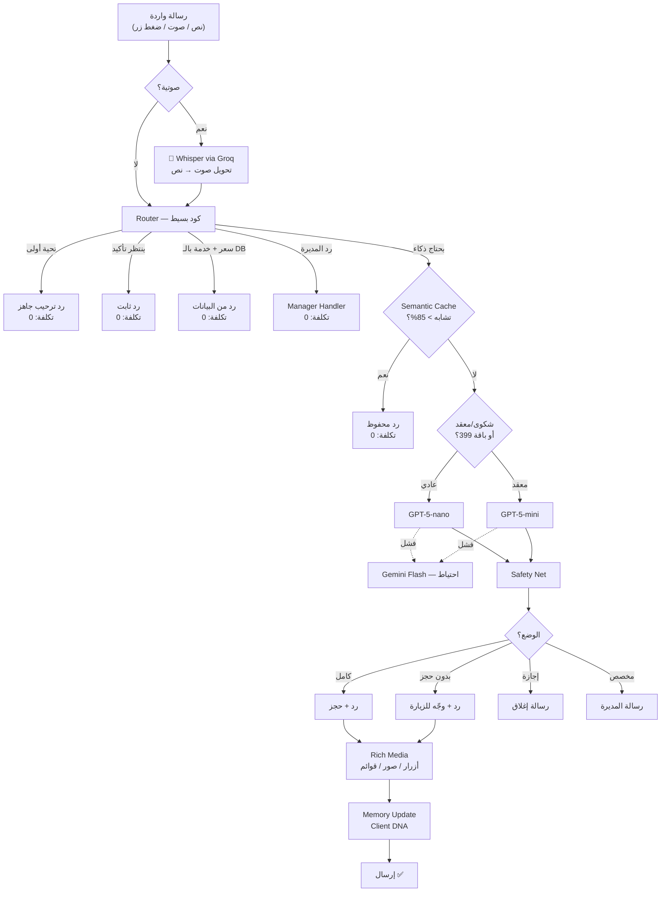
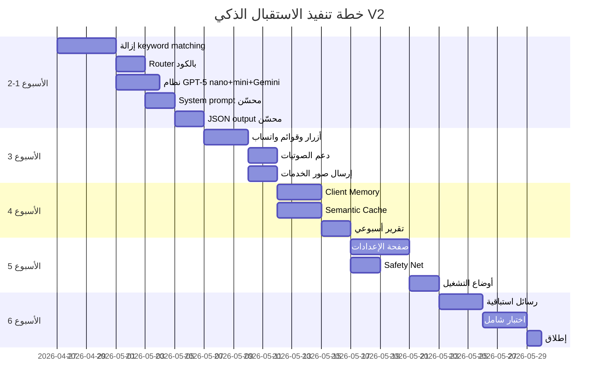

# خطة الاستقبال الذكي V2 — SERVIX AI Reception

> **الهدف:** تحويل الاستقبال من "بوت keyword matching" إلى "موظف استقبال ذكي يفهم، يسمع، يتعلم، ويبيع"

---

## المعمارية النهائية



---

## المرحلة 1: الأساس (الأسبوع 1-2)

### 1.1 إزالة الـ Keyword Matching وتبسيط الكود

> **الهدف:** تقليل `ai-reception.service.ts` من 2052 سطر إلى ~600 سطر

#### الدوال التي تُحذف (الـ AI يتولاها):
- `isStopFollowUpText` — الـ AI يفهم "خلاص" من السياق
- `isBookingIntentText` — الـ AI يكشف نية الحجز
- `isBookingCancelText` — الـ AI يفهم الإلغاء
- `isAmbiguousText` — الـ AI يتعامل مع الغموض
- `isPriceNegotiationText` — الـ AI يرفض التفاوض
- `isPriceQuestionText` — الـ AI يجاوب عن الأسعار
- `isMenuRequestText` — الـ AI يعرض القائمة
- `isFormalToneRequest` — الـ AI يتكيف مع النبرة
- `isGreetingOnlyText` — Router يمسكها
- `detectDirectEscalation` — الـ AI يصعّد بنفسه
- `findServiceInText` (regex) — الـ AI يستخلص الخدمة

#### الدوال التي تبقى (حماية بالكود):
- `sanitizePrematureConfirmation` ← يبقى (منع تأكيد وهمي)
- `applyOfficialPricingToPayload` ← يبقى (حماية الأسعار)
- `applyAvoidedPhrases` ← يبقى (كلمات ممنوعة)
- `handleProposedAction` ← يبقى (إرسال للمديرة)
- `handleEscalation` ← يبقى (تصعيد)

#### الملفات المتأثرة:
- [MODIFY] [ai-reception.service.ts](file:///c:/Users/Admin/projects/servix/apps/api/src/modules/salon/ai-reception/ai-reception.service.ts) — إعادة كتابة `handleCustomerMessage` بالكامل
- [DELETE] النظام القديم [whatsapp-bot.service.ts](file:///c:/Users/Admin/projects/servix/apps/api/src/shared/whatsapp/whatsapp-bot.service.ts) — يُستبدل بـ redirect لـ AIReceptionService
- [MODIFY] [gemini.service.ts](file:///c:/Users/Admin/projects/servix/apps/api/src/shared/ai/gemini.service.ts) — تبسيط لـ Gemini + GPT فقط

---

### 1.2 Router بالكود (بدون AI)

> **الهدف:** 70% من الرسائل تُعالج بدون API call

```typescript
// الترتيب مهم:
async routeMessage(params): Promise<RouteDecision> {
  // 1. Opt-out (أعلى أولوية)
  if (this.antiBan.isOptOutKeyword(text)) return { route: 'opt_out' };
  
  // 2. رد المديرة
  if (this.isManagerPhone(phone)) return { route: 'manager_reply' };
  
  // 3. وضع الإجازة
  if (settings.mode === 'vacation') return { route: 'vacation_reply' };
  
  // 4. ينتظر تأكيد المديرة
  if (state.bookingStep === 'awaiting_owner_approval') 
    return { route: 'static', reply: 'طلبك بانتظار تأكيد الصالون.' };
  
  // 5. ضغط زر (button reply) — نعرف النية مباشرة
  if (isButtonReply(text)) return { route: 'button_handler', buttonId: text };
  
  // 6. سؤال سعر بسيط يُجاب من DB
  const priceAnswer = this.tryAnswerFromDB(text, salonContext);
  if (priceAnswer) return { route: 'db_answer', reply: priceAnswer };
  
  // 7. كل شي ثاني → AI
  return { route: 'ai', complexity: this.estimateComplexity(state, text) };
}
```

---

### 1.3 نظام النماذج الهجين (GPT-5-nano + GPT-5-mini)

> **الهدف:** nano للعادي (80%)، mini للمعقد (20%)، Gemini احتياط، Whisper للصوت

#### [NEW] `ai-provider.service.ts`

```typescript
class AIProviderService {
  async chat(params: {
    messages: Message[];
    complexity: 'simple' | 'complex';
    tier: 'basic' | 'standard' | 'premium';
  }): Promise<AIResponse> {
    
    // باقة 199 = بدون AI أصلاً (ما توصل هنا)
    // باقة 299 = GPT-5-nano دائماً
    // باقة 399 = nano عادي، mini للمعقد
    
    const model = (params.tier === 'premium' && params.complexity === 'complex')
      ? 'gpt-5-mini'
      : 'gpt-5-nano';
    
    try {
      return await this.callOpenAI(params.messages, model);
    } catch {
      // Fallback: Gemini Flash (شركة مختلفة = حماية من انقطاع OpenAI)
      return await this.callGeminiFlash(params.messages);
    }
  }
  
  async transcribeVoice(audioBuffer: Buffer): Promise<string> {
    return this.callWhisperViaGroq(audioBuffer);
  }
}
```

#### النماذج المستخدمة:

| النموذج | الدور | متى يشتغل | التكلفة |
|---------|-------|-----------|--------|
| GPT-5-nano | الأساسي | 80% — محادثات عادية | $0.05/M input, $0.40/M output |
| GPT-5-mini | المعقد | 20% — شكاوى + تردد + باقة 399 | $0.25/M input, $2.00/M output |
| Gemini Flash | الاحتياط | فقط لو OpenAI وقعت | $0.15/M input, $0.60/M output |
| Whisper (Groq) | الصوت | كل صوتية | مجاني |

#### متى الـ Router يختار mini بدل nano؟

```typescript
private estimateComplexity(state: ConversationState, text: string): 'simple' | 'complex' {
  // معقد لو:
  if (state.escalationCount > 0) return 'complex';           // عميل سبق صُعّد
  if (state.messageCount > 8) return 'complex';               // محادثة طويلة
  if (state.lastSentiment === 'negative') return 'complex';   // عميل زعلان
  if (text.length > 200) return 'complex';                    // رسالة طويلة (صوتية مفرّغة)
  return 'simple';
}
```

#### ليش هالتوزيع؟

- **nano + mini من نفس الشركة (OpenAI)** = نفس الـ prompt يشتغل على الاثنين بدون تعديل
- **Gemini من شركة مختلفة (Google)** = حماية حقيقية لو OpenAI كلها وقعت
- **Whisper عبر Groq** = أدق transcription عربي + مجاني بالكامل

---

### 1.4 إرسال حالة المحادثة للـ AI

> **الهدف:** الـ AI يعرف السياق الكامل → يفهم "خلاص" = "أوكي" مو "توقف"

```typescript
// يُضاف للـ system prompt مع كل رسالة:
const stateContext = `
حالة المحادثة الحالية:
- المرحلة: ${state.bookingStep || 'بداية'}
- الخدمة المختارة: ${state.selectedServiceName || 'لم تُختر'}
- التاريخ: ${state.selectedDate || 'لم يُحدد'}
- الوقت: ${state.selectedTime || 'لم يُحدد'}
- اسم العميل: ${state.customerName || 'غير معروف'}
- رقم الطلب: ${state.requestId || 'لا يوجد'}
- ينتظر موافقة: ${state.awaitingOwnerApproval ? 'نعم' : 'لا'}
`;
```

---

### 1.5 JSON Output محسّن من الـ AI

> **الهدف:** الـ AI يرجع قرارات واضحة، الكود ينفّذها

```json
{
  "reply": "رد العميل",
  "intent": "book_appointment",
  "action": "collect_info | submit_booking | escalate | answer_only | cancel",
  "extractedData": {
    "serviceName": "صبغة",
    "date": "بكرة",
    "time": "5 مساء",
    "customerName": null
  },
  "nextQuestion": "ask_time",
  "messageType": "text | buttons | list | image",
  "buttons": ["نعم", "لا", "خدمة ثانية"],
  "needsEscalation": false,
  "escalationReason": null,
  "sentiment": "positive | neutral | negative | angry",
  "confidence": 0.95,
  "wantsToCancel": false,
  "isNegotiatingPrice": false,
  "clientLearnings": {
    "preference": "prefers_evening",
    "note": "sensitive_to_price"
  }
}
```

---

## المرحلة 2: واتساب محترف (الأسبوع 3)

### 2.1 Rich Media — أزرار وقوائم وصور

#### [NEW] `whatsapp-rich-media.service.ts`

```typescript
class WhatsAppRichMediaService {
  // أزرار سريعة (max 3)
  async sendButtons(params: {
    to: string; body: string; buttons: string[];
  })
  
  // قائمة تفاعلية (max 10 عناصر)
  async sendList(params: {
    to: string; body: string; 
    sections: { title: string; rows: { id: string; title: string; description: string }[] }[];
  })
  
  // صورة مع caption
  async sendImage(params: {
    to: string; imageUrl: string; caption: string;
  })
  
  // موقع
  async sendLocation(params: {
    to: string; lat: number; lng: number; name: string; address: string;
  })
}
```

#### متى يُستخدم كل نوع:
- **أزرار:** "أرسل الطلب؟" → [✅ نعم] [❌ لا]
- **قائمة:** "اختاري الخدمة" → قائمة الخدمات
- **صورة:** العميل يسأل عن خدمة → صورة من Smart Menu
- **موقع:** "وين الصالون؟" → خريطة

---

### 2.2 الصوتيات

#### [MODIFY] `whatsapp-evolution-webhook.controller.ts`

```typescript
// عند استلام رسالة صوتية:
if (message.type === 'audio') {
  const audioBuffer = await this.downloadMedia(message.mediaUrl);
  const transcription = await this.aiProvider.transcribeVoice(audioBuffer);
  
  // تحليل ذكي قبل الإرسال للـ AI
  text = transcription;
  metadata.isVoiceMessage = true;
  metadata.originalDuration = message.duration;
}
```

---

## المرحلة 3: الذاكرة والتعلم (الأسبوع 4)

### 3.1 Client Memory — يتذكر كل عميل

#### [NEW] `ai-client-memory.service.ts`

```typescript
interface ClientMemory {
  phone: string;
  name: string;
  preferredServices: string[];        // أكثر خدمات تطلبها
  preferredDay: string;               // اليوم المفضل
  preferredTime: string;              // الوقت المفضل
  preferredEmployee: string;          // الموظفة المفضلة
  communicationStyle: 'brief' | 'detailed';  // تحب ردود قصيرة ولا طويلة
  pricesSensitive: boolean;           // تسأل عن الأسعار دائماً
  totalConversations: number;
  totalBookings: number;
  lastComplaint: string | null;
  notes: string[];                    // ملاحظات من المحادثات
}
```

يُحقن في الـ prompt:

```
معلومات عن العميل:
- الاسم: سارة
- عميلة متكررة (12 زيارة)
- تحجز عادة: صبغة عند نورة، الخميس مساءً
- تفضل الردود القصيرة
- حساسة للأسعار — ذكري المميزات مع السعر
```

---

### 3.2 Semantic Cache

#### [NEW] `ai-semantic-cache.service.ts`

```typescript
class AISemanticCacheService {
  // عند كل رد من AI:
  async cacheResponse(question: string, response: AIResponse, tenantId: string)
  
  // قبل كل طلب AI:
  async findSimilar(question: string, tenantId: string): Promise<AIResponse | null>
  // يستخدم cosine similarity على embeddings بسيطة
  // threshold: 0.85
}
```

يوفر **~40%** من طلبات الـ AI. الأسئلة المتكررة مثل "كم سعر الصبغة" و "وين موقعكم" تنحل من الـ cache.

---

### 3.3 تحليل المحادثات + تقرير أسبوعي

#### [NEW] `ai-analytics.service.ts`

```typescript
// يشتغل كل أحد صباحاً (Cron)
@Cron('0 9 * * 0')
async sendWeeklyReport() {
  for (const salon of activeSalons) {
    const report = await this.buildWeeklyReport(salon);
    await this.sendToManager(salon.managerPhone, report);
  }
}

// التقرير يشمل:
// - عدد المحادثات والحجوزات ونسبة التحويل
// - أكثر خدمة مطلوبة
// - أكثر وقت مطلوب
// - خدمات سألوا عنها ومو موجودة (فرص!)
// - شكاوى متكررة
// - تكلفة الـ AI مقابل توفير الموظفة
```

---

## المرحلة 4: صفحة الإعدادات (الأسبوع 5)

### 4.1 إعدادات جديدة في الـ DB

#### [MODIFY] `settings.constants.ts` — إضافة:

```typescript
// أوضاع التشغيل
ai_reception_mode: 'full' | 'reply_only' | 'vacation' | 'custom'
ai_vacation_start: string          // تاريخ بداية الإجازة
ai_vacation_end: string            // تاريخ نهاية الإجازة  
ai_vacation_message: string        // رسالة الإجازة
ai_custom_redirect_message: string // رسالة التوجيه المخصصة
ai_walk_in_message: string         // رسالة "زورينا مباشرة"

// الميزات
ai_voice_enabled: boolean
ai_rich_media_enabled: boolean
ai_client_memory_enabled: boolean
ai_weekly_report_enabled: boolean
ai_auto_confirm_booking: boolean

// الباقة
ai_tier: 'basic' | 'standard' | 'premium'
ai_monthly_message_limit: number
ai_messages_used_this_month: number
```

### 4.2 صفحة الإعدادات (Frontend)

#### [MODIFY] صفحة WhatsApp في الداشبورد — 7 أقسام:

1. **التشغيل الأساسي** — تشغيل/إيقاف + اسم المساعد + النبرة
2. **وضع التشغيل** — كامل / بدون حجز / إجازة / مخصص
3. **رسالة الترحيب** — نص قابل للتعديل + نصائح
4. **مستوى الذكاء** — حسب الباقة + toggles للميزات
5. **إعدادات الحجز** — يدوي/تلقائي + المدة + المواعيد
6. **الحماية** — كلمات ممنوعة + كلمات تصعيد + خصوصية
7. **المعرفة المحفوظة** — CRUD على Knowledge Snippets + إحصائيات

---

## المرحلة 5: Safety Net + الحمايات (الأسبوع 5-6)

### 5.1 Safety Net — فحص الرد قبل الإرسال

#### [NEW] `ai-safety-net.service.ts`

```typescript
class AISafetyNetService {
  sanitize(reply: string, context: SalonContext): string {
    let safe = reply;
    
    // 1. فحص السعر — أي رقم يطابق الأسعار الرسمية؟
    safe = this.validatePrices(safe, context.services);
    
    // 2. فحص التأكيد الوهمي
    safe = this.blockPrematureConfirmation(safe);
    
    // 3. فحص كشف الهوية
    safe = this.removeAIIdentityLeaks(safe);
    
    // 4. فحص الكلمات الممنوعة
    safe = this.applyAvoidedPhrases(safe, context.settings);
    
    // 5. فحص الطول (max 3 أسطر)
    safe = this.truncateIfNeeded(safe, 3);
    
    // 6. فحص الإيموجي (max 1)
    safe = this.limitEmojis(safe, 1);
    
    return safe;
  }
}
```

### 5.2 حماية التكلفة

```typescript
// قبل كل AI call:
async checkUsageLimit(tenantId: string, tier: string): Promise<boolean> {
  const used = await this.getMonthlyUsage(tenantId);
  const limit = tier === 'premium' ? 5000 : tier === 'standard' ? 1000 : 0;
  
  if (used >= limit) {
    // أبلغ المديرة
    await this.notifyLimitReached(tenantId);
    return false; // fallback to static replies
  }
  return true;
}
```

---

## المرحلة 6: الرسائل الاستباقية (الأسبوع 6)

### 6.1 Scheduled Messages

#### [NEW] `ai-proactive.service.ts`

```typescript
// تذكير بالموعد (قبل يوم)
@Cron('0 10 * * *')
async sendAppointmentReminders()

// متابعة بعد الزيارة (بعد يوم)
@Cron('0 18 * * *')  
async sendPostVisitFollowUp()

// إعادة جذب العملاء الغائبين (بعد 30 يوم بدون زيارة)
@Cron('0 11 * * 1') // كل اثنين
async sendWinBackMessages()
```

---

## ملخص الملفات

### ملفات جديدة:
| الملف | الوصف |
|-------|-------|
| `ai-provider.service.ts` | GPT-5-nano + GPT-5-mini + Gemini fallback + Whisper |
| `ai-safety-net.service.ts` | فحص الرد قبل الإرسال |
| `ai-semantic-cache.service.ts` | cache ذكي للأسئلة المتكررة |
| `ai-client-memory.service.ts` | ذاكرة العميل |
| `ai-analytics.service.ts` | تحليل + تقرير أسبوعي |
| `ai-proactive.service.ts` | رسائل استباقية |
| `whatsapp-rich-media.service.ts` | أزرار + قوائم + صور |

### ملفات تُعدّل:
| الملف | التعديل |
|-------|---------|
| `ai-reception.service.ts` | إعادة كتابة — 2052 → ~600 سطر |
| `gemini.service.ts` | تبسيط — Gemini كـ fallback فقط |
| `ai-reception-settings.service.ts` | إضافة الإعدادات الجديدة |
| `whatsapp-evolution-webhook.controller.ts` | دعم الصوتيات + الأزرار |
| `settings.constants.ts` | إضافة ~15 setting جديد |
| صفحة الداشبورد | 7 أقسام إعدادات جديدة |

### ملفات تُحذف/تُعطّل:
| الملف | السبب |
|-------|-------|
| `whatsapp-bot.service.ts` | النظام القديم — يُستبدل |
| n8n workflow | يُلغى — الكود يتعامل مباشرة |

---

## التكلفة النهائية لكل صالون (100 رسالة/يوم)

| الباقة | السعر | النموذج | تكلفة AI/شهر | الهامش |
|--------|-------|---------|-------------|--------|
| 199 ريال (أساسي) | ردود جاهزة فقط | بدون AI | **0 ريال** | 100% |
| 299 ريال (متوسط) | GPT-5-nano | nano فقط | **~4 ريال** | 98.7% |
| 399 ريال (أعلى) | GPT-5-nano + mini | nano 80% + mini 20% | **~8 ريال** | 98% |

### تفصيل الحسبة (100 رسالة/يوم × 30 يوم = 3,000 رسالة/شهر):

**GPT-5-nano:** 3,000 × 5,000 tokens input = 15M tokens × $0.05/M = **$0.75** + output **$0.60** = **$1.35/شهر = ~5 ريال**

**GPT-5-mini (20% فقط):** 600 × 5,000 = 3M tokens × $0.25/M = **$0.75** + output **$0.60** = **$1.35 إضافية**

**مع Prompt Caching:** التكلفة تنخفض **50-70%** إضافية لأن system prompt يتكرر

### لـ 10 صالونات:
| السيناريو | التكلفة الشهرية | الدخل | صافي الربح |
|-----------|----------------|-------|----------|
| كلهم باقة 299 | ~40 ريال | 2,990 ريال | **2,950 ريال** |
| كلهم باقة 399 | ~80 ريال | 3,990 ريال | **3,910 ريال** |
| أسوأ سيناريو (حركة عالية جداً) | ~200 ريال | 3,990 ريال | **3,790 ريال** |

---

## الجدول الزمني



---

## خطة الاختبار

### اختبار آلي:
- Unit tests لـ Safety Net (أسعار، تأكيد وهمي، هوية)
- Unit tests لـ Router (كل مسار)
- Integration test: رسالة نصية → رد من GPT-5-nano
- Integration test: رسالة معقدة → رد من GPT-5-mini
- Integration test: OpenAI down → fallback لـ Gemini Flash
- Integration test: صوتية → Whisper → رد

### اختبار يدوي:
- 20 سيناريو محادثة بلهجات مختلفة (خليجي، حجازي، مصري)
- سيناريو شكوى → تصعيد → رد المديرة → تعلم
- سيناريو حجز كامل → موافقة → تأكيد
- سيناريو حجز → رفض → وقت بديل → قبول
- اختبار الصوتيات (صوتية واضحة + صوتية بضجيج)
- اختبار الأزرار والقوائم التفاعلية
- اختبار كل وضع تشغيل (كامل / بدون حجز / إجازة / مخصص)
- اختبار تجاوز حد الرسائل الشهري

---

## API Keys المطلوبة

| الخدمة | من وين | المطلوب |
|--------|--------|--------|
| OpenAI API (GPT-5-nano + mini) | [platform.openai.com](https://platform.openai.com) | API Key + شحن $10 (~37 ريال) |
| Google AI (Gemini Flash — fallback) | [aistudio.google.com](https://aistudio.google.com) | API Key — مجاني |
| Groq (Whisper) | [console.groq.com](https://console.groq.com) | API Key — مجاني |

**التكلفة الأولية للبدء: 37 ريال فقط** (شحن OpenAI)

---

> **الخطة جاهزة للتنفيذ. المدة: 6 أسابيع. النتيجة: استقبال ذكي حقيقي يفهم، يسمع، يتعلم، ويبيع.**
>
> **النماذج: GPT-5-nano (أساسي) + GPT-5-mini (معقد) + Gemini Flash (احتياط) + Whisper (صوت)**

---

## حالة التنفيذ

| المرحلة | الوصف | الحالة |
|---------|-------|--------|
| 1 | الأساس (Router + AIProviderService + AISafetyNetService + V2 prompt) | ✅ تم |
| 2 | واتساب محترف (Rich Media: أزرار/قوائم + الصوتيات عبر Whisper) | ✅ تم |
| 3 | الذاكرة والتعلم (Client Memory + Semantic Cache + Analytics) | ✅ تم |
| 4 | صفحة الإعدادات + أوضاع التشغيل (full/reply_only/vacation/custom) + endpoint الإحصائيات | ✅ تم |
| 5 | الرسائل الاستباقية (Follow-up + Re-engagement placeholder) + الباقات + التنظيف | ✅ تم |
| 6 | الاختبارات + التنظيف النهائي (94 AI test، 653 إجمالي) | ✅ تم |

### للتشغيل
1. أضف في `apps/api/.env`:
   ```env
   OPENAI_API_KEY=sk-...
   GROQ_API_KEY=gsk_...
   GEMINI_API_KEY=...   # اختياري — للـ fallback
   ```
2. تأكد Redis شغّال (`REDIS_HOST` / `REDIS_PORT` في الـ env). بدون Redis تعمل الذاكرة + الكاش + الـ analytics بـ silent no-op.
3. `pnpm dev`
4. اربط واتساب من `/settings/whatsapp` في الداشبورد، امسح QR
5. أرسل رسالة من رقم آخر للرقم المربوط

### Crons تشتغل تلقائياً
- `AIReceptionExpirer` — كل 5 دقائق (الطلبات المنتهية)
- `AIProactiveService.checkPendingFollowUps` — كل 10 دقائق
- `AIProactiveService.checkReEngagement` — يومياً 10 صباحاً (placeholder)
- `AIAnalyticsService.sendWeeklyReports` — كل أحد 9 صباحاً

### الملفات الجديدة (V2)
| الملف | الوظيفة |
|-------|---------|
| `apps/api/src/shared/ai/ai-provider.service.ts` | GPT-5-nano/mini + Gemini fallback + Whisper-via-Groq |
| `apps/api/src/modules/salon/ai-reception/ai-safety-net.service.ts` | فلترة الرد قبل الإرسال (6 guards) |
| `apps/api/src/modules/salon/ai-reception/ai-client-memory.service.ts` | ذاكرة العميل في Redis (TTL 90 يوم) |
| `apps/api/src/modules/salon/ai-reception/ai-semantic-cache.service.ts` | كاش الأسئلة المتكررة (Jaccard، 24س) |
| `apps/api/src/modules/salon/ai-reception/ai-analytics.service.ts` | تتبع + تقرير أسبوعي |
| `apps/api/src/modules/salon/ai-reception/ai-proactive.service.ts` | متابعة الحجوزات المعلّقة + إعادة تفاعل |
| `apps/api/src/modules/salon/ai-reception/ai-reception.controller.ts` | endpoint `/salon/ai-reception/stats` |
| `apps/api/src/modules/salon/whatsapp-evolution/whatsapp-rich-media.service.ts` | أزرار/قوائم/صور + تنزيل media وارد |
| `apps/dashboard/src/services/ai-reception.service.ts` | عميل الواجهة لـ stats |

### الملفات المعطّلة (V1 — موجودة لكن ما تُستدعى)
- `apps/api/src/modules/salon/ai-reception/n8n.client.ts` — أُزيل من providers، لا يُستدعى
- `apps/api/src/shared/whatsapp/whatsapp-bot.service.ts` — النظام القديم
